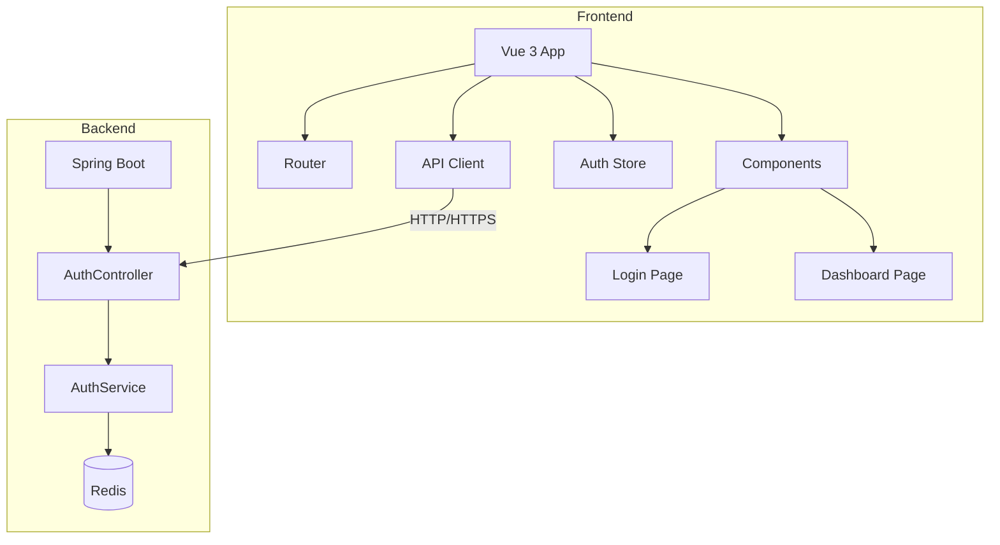
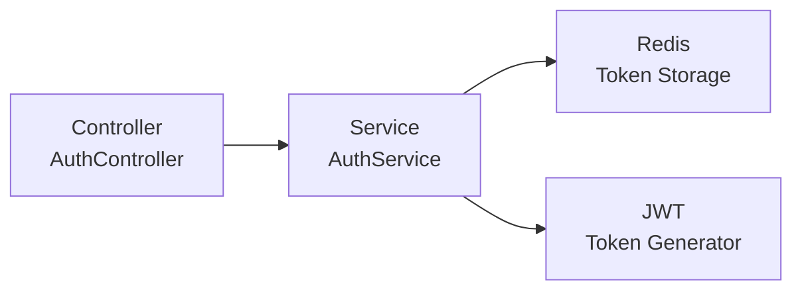

## 1. Architecture Design



## 2. Technology Description
- **Frontend**: Vue 3 + TypeScript + Vite + Tailwind CSS + Vue Router
- **Initialization Tool**: vite-init
- **Backend**: Spring Boot (已存在)
- **Authentication**: JWT Token (access token + refresh token)
- **State Management**: Vue 3 Composition API + reactive
- **Icons**: lucide-vue-next

## 3. Route Definitions
| Route | Purpose | Authentication Required |
|-------|---------|------------------------|
| /login | 登录页面 | No |
| /dashboard | 主页面/仪表盘 | Yes |

## 4. API Definitions

```typescript
// 登录请求
interface LoginRequest {
  username: string;
  password: string;
}

// 登录响应
interface LoginResponse {
  token: string;
  refreshToken: string;
  user: {
    username: string;
  };
}

// 刷新 token 请求
interface RefreshTokenRequest {
  refreshToken: string;
}

// 通用响应
interface Result<T> {
  code: number;
  message: string;
  data: T;
}
```

**API Endpoints**:
- `POST /api/auth/login` - 用户登录
- `POST /api/auth/logout` - 用户登出
- `POST /api/auth/refresh` - 刷新 token
- `GET /api/auth/current` - 获取当前用户信息

## 5. Server Architecture Diagram



## 6. Data Model

### 6.1 Data Storage (Frontend Local Storage)
- `accessToken`: 访问令牌
- `refreshToken`: 刷新令牌
- `user`: 用户信息

### 6.2 Auth Store Structure
```typescript
interface AuthState {
  isAuthenticated: boolean;
  user: { username: string } | null;
  accessToken: string | null;
  refreshToken: string | null;
}

interface AuthActions {
  login(username: string, password: string): Promise<void>;
  logout(): Promise<void>;
  refreshToken(): Promise<void>;
  checkAuth(): Promise<void>;
}
```
