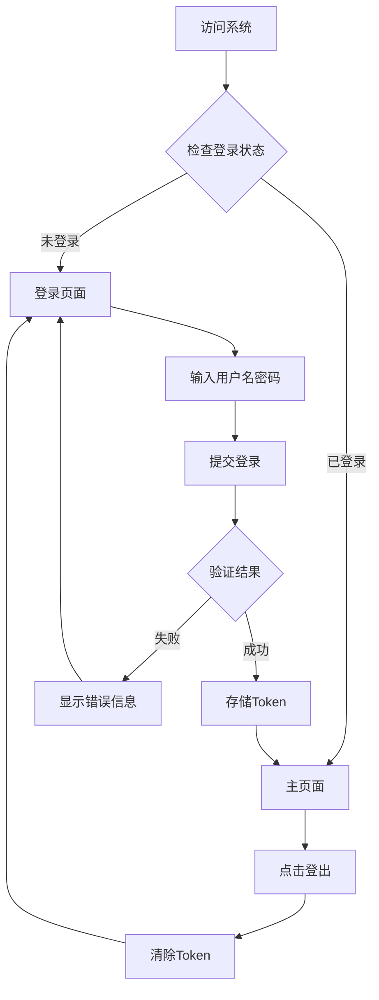

## 1. Product Overview
健康助手前端登录系统，为用户提供安全、美观的登录登出功能，对接已有的后端认证接口。
- 解决用户身份验证问题，保护系统安全；提供友好的用户体验
- 为健康助手平台提供基础的用户认证基础设施

## 2. Core Features

### 2.1 User Roles
| Role | Registration Method | Core Permissions |
|------|---------------------|------------------|
| Normal User | 预设账户登录 | 访问系统功能 |

### 2.2 Feature Module
1. **登录页面**: 用户名/密码输入、登录按钮、错误提示
2. **主页面/仪表盘**: 用户信息展示、登出功能

### 2.3 Page Details
| Page Name | Module Name | Feature description |
|-----------|-------------|---------------------|
| 登录页面 | 登录表单 | 输入用户名和密码，点击登录按钮调用后端接口，显示错误信息 |
| 主页面 | 用户信息 | 显示当前登录用户信息，提供登出按钮 |
| 主页面 | 导航栏 | 顶部导航，显示用户状态 |

## 3. Core Process
用户访问系统 → 检查登录状态 → 未登录则跳转到登录页面 → 输入凭证 → 验证成功 → 存储 Token → 跳转到主页面 → 用户操作 → 点击登出 → 清除 Token → 跳转回登录页面

## 4. User Interface Design
### 4.1 Design Style
- **Primary Color**: 蓝绿色 (#0ea5e9) - 传达健康、专业、可信的感觉
- **Secondary Color**: 深靛蓝 (#1e293b) - 作为背景和文字色，营造现代感
- **Button Style**: 圆角矩形，带有悬停效果和阴影
- **Font**: 使用 Inter 或系统默认字体，清晰易读
- **Layout Style**: 卡片式布局，居中对齐，简洁大气
- **Icon**: 使用 lucide-vue-next 图标库，线性风格

### 4.2 Page Design Overview
| Page Name | Module Name | UI Elements |
|-----------|-------------|-------------|
| 登录页面 | 登录表单 | 渐变色背景，白色卡片，输入框带图标，按钮有悬停动画，错误提示红色 |
| 主页面 | 用户卡片 | 浅灰色背景，顶部导航，用户信息卡片，流畅的动画过渡 |

### 4.3 Responsiveness
- Desktop-first 设计，自适应移动端
- 在小屏幕上调整卡片大小和布局
- 触摸优化的按钮尺寸

### 4.4 3D Scene Guidance
不适用
