# HealthAgent 智慧健康助手 — 详细设计文档

> **版本**: v2.0\
> **日期**: 2026-05-12\
> **项目路径**: C:\Project\Code\HealthAgent

***

## 目录

1. [项目概述](#1-项目概述)
2. [系统架构设计](#2-系统架构设计)
3. [技术栈与依赖](#3-技术栈与依赖)
4. [数据库设计](#4-数据库设计)
5. [后端详细设计](#5-后端详细设计)
6. [前端详细设计](#6-前端详细设计)
7. [AI 对话引擎设计](#7-ai-对话引擎设计)
8. [认证与安全](#8-认证与安全)
9. [API 接口文档](#9-api-接口文档)
10. [界面展示](#10-界面展示)
11. [部署与运维](#11-部署与运维)

***

## 1. 项目概述

### 1.1 项目背景

HealthAgent 是一款智慧健康助手应用，旨在为用户提供便捷的保单查询、体检预约和健康咨询服务。系统集成了大语言模型（LLM）能力，通过意图识别自动理解用户需求，智能分发至对应业务模块，实现"对话即服务"的交互体验。

### 1.2 核心功能

| 功能模块 | 描述                         |
| ---- | -------------------------- |
| 智能对话 | 基于意图识别的 AI 对话，支持自然语言交互     |
| 保单查询 | 按保单号/投保人/身份证号等多维度查询保单信息    |
| 体检预约 | 多轮对话收集信息，自动预约体检，支持 8 家三甲医院 |
| 健康咨询 | 通用健康问答与生活方式建议              |
| 语音输入 | 浏览器原生 Web Speech API 语音识别  |
| 数据脱敏 | 保单号/身份证/手机号等敏感信息自动脱敏展示     |

### 1.3 目标用户

- 保险客户：查询个人保单信息、了解保障详情
- 体检用户：在线预约体检、查看预约记录
- 健康关注者：获取健康咨询与建议

***

## 2. 系统架构设计

### 2.1 总体架构


```mermaid
graph TB
    subgraph "前端层 Frontend"
        UI[Vue 3 + TypeScript]
        UI --> Router[Vue Router]
        UI --> AuthComp[useAuth 组合式函数]
        UI --> ChatUI[ChatPage 对话界面]
        UI --> PolicyUI[PolicyPage 保单页面]
        UI --> ExamUI[ExaminationPages 体检页面]
        UI --> DashUI[DashboardPage 仪表盘]
    end

    subgraph "网关层 Gateway"
        Nginx[Vite Dev Proxy / Nginx]
        Nginx --> |"/api/*"| Backend
    end

    subgraph "后端层 Backend — Spring Boot 3.4.1"
        Controller[REST Controllers]
        Controller --> SmartChatCtrl[SmartChatController]
        Controller --> PolicyCtrl[PolicyController]
        Controller --> ExamCtrl[ExaminationController]
        Controller --> AuthCtrl[AuthController]

        Service[业务服务层]
        Service --> SmartChatSvc[SmartChatService 编排]
        Service --> IntentSvc[IntentRecognitionService]
        Service --> ExamIntentSvc[ExaminationIntentService]
        Service --> PolicySvc[PolicyService]
        Service --> ExamSvc[ExaminationService]
        Service --> AuthSvc[AuthService]
        Service --> SessionMgr[SessionManager]
        Service --> DataMaskSvc[DataMaskingService]
        Service --> SkillExecSvc[SkillExecutionService]

        ChatClient[LLM 客户端层]
        ChatClient --> AbstractCC[AbstractChatClient 模板方法]
        AbstractCC --> GlmCC[GlmChatClient 智谱GLM]
        AbstractCC --> QwenCC[QwenChatClient 通义千问]
        ChatClient --> Factory[ChatClientFactory 工厂]

        Interceptor[AuthInterceptor 认证拦截]
        Config[WebConfig CORS + 拦截器注册]
    end

    subgraph "数据层 Data"
        MySQL[(MySQL 8.0)]
        Redis[(Redis)]
        MyBatisPlus[MyBatis-Plus 3.5.5]
    end

    subgraph "外部服务 External"
        GLMAPI[智谱AI GLM-4.6v API]
        QwenAPI[通义千问 DashScope API]
    end

    UI --> Nginx
    Controller --> Service
    Service --> ChatClient
    Service --> MyBatisPlus
    MyBatisPlus --> MySQL
    AuthSvc --> Redis
    GlmCC --> GLMAPI
    QwenCC --> QwenAPI
    Interceptor --> AuthSvc
    Config --> Interceptor
```

### 2.2 核心流程 — 智能对话

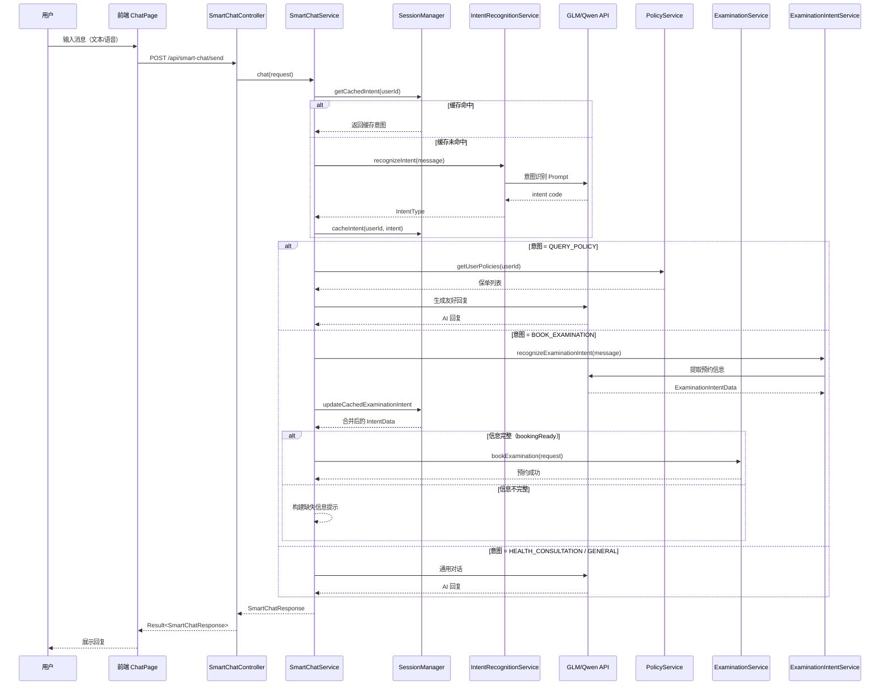
```mermaid
sequenceDiagram
    participant U as 用户
    participant F as 前端 ChatPage
    participant C as SmartChatController
    participant S as SmartChatService
    participant SM as SessionManager
    participant IR as IntentRecognitionService
    participant LLM as GLM/Qwen API
    participant PS as PolicyService
    participant ES as ExaminationService
    participant EIS as ExaminationIntentService

    U->>F: 输入消息（文本/语音）
    F->>C: POST /api/smart-chat/send
    C->>S: chat(request)
    S->>SM: getCachedIntent(userId)
    
    alt 缓存命中
        SM-->>S: 返回缓存意图
    else 缓存未命中
        S->>IR: recognizeIntent(message)
        IR->>LLM: 意图识别 Prompt
        LLM-->>IR: intent code
        IR-->>S: IntentType
        S->>SM: cacheIntent(userId, intent)
    end

    alt 意图 = QUERY_POLICY
        S->>PS: getUserPolicies(userId)
        PS-->>S: 保单列表
        S->>LLM: 生成友好回复
        LLM-->>S: AI 回复
    else 意图 = BOOK_EXAMINATION
        S->>EIS: recognizeExaminationIntent(message)
        EIS->>LLM: 提取预约信息
        LLM-->>EIS: ExaminationIntentData
        S->>SM: updateCachedExaminationIntent
        SM-->>S: 合并后的 IntentData
        alt 信息完整（bookingReady）
            S->>ES: bookExamination(request)
            ES-->>S: 预约成功
        else 信息不完整
            S-->>S: 构建缺失信息提示
        end
    else 意图 = HEALTH_CONSULTATION / GENERAL
        S->>LLM: 通用对话
        LLM-->>S: AI 回复
    end

    S-->>C: SmartChatResponse
    C-->>F: Result<SmartChatResponse>
    F-->>U: 展示回复
```

### 2.3 意图识别流程

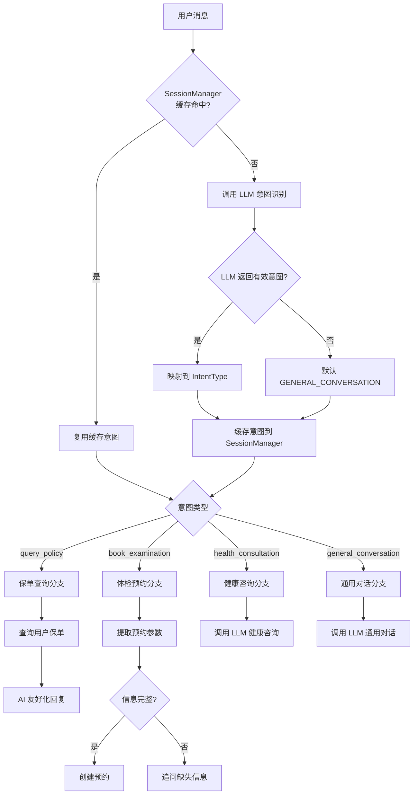
```mermaid
flowchart TD
    A[用户消息] --> B{SessionManager<br/>缓存命中?}
    B -->|是| C[复用缓存意图]
    B -->|否| D[调用 LLM 意图识别]
    D --> E{LLM 返回有效意图?}
    E -->|是| F[映射到 IntentType]
    E -->|否| G[默认 GENERAL_CONVERSATION]
    F --> H[缓存意图到 SessionManager]
    G --> H
    
    C --> I{意图类型}
    H --> I
    
    I -->|query_policy| J[保单查询分支]
    I -->|book_examination| K[体检预约分支]
    I -->|health_consultation| L[健康咨询分支]
    I -->|general_conversation| M[通用对话分支]
    
    J --> N[查询用户保单]
    N --> O[AI 友好化回复]
    
    K --> P[提取预约参数]
    P --> Q{信息完整?}
    Q -->|是| R[创建预约]
    Q -->|否| S[追问缺失信息]
    
    L --> T[调用 LLM 健康咨询]
    M --> U[调用 LLM 通用对话]
```

### 2.4 体检预约多轮对话流程

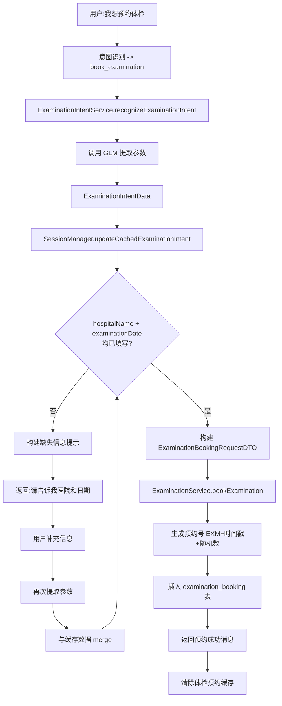
```mermaid
flowchart TD
    A[用户:我想预约体检] --> B[意图识别 -> book_examination]
    B --> C[ExaminationIntentService.recognizeExaminationIntent]
    C --> D[调用 GLM 提取参数]
    D --> E[ExaminationIntentData]
    E --> F[SessionManager.updateCachedExaminationIntent]
    F --> G{hospitalName + examinationDate<br/>均已填写?}
    
    G -->|否| H[构建缺失信息提示]
    H --> I[返回:请告诉我医院和日期]
    I --> J[用户补充信息]
    J --> K[再次提取参数]
    K --> L[与缓存数据 merge]
    L --> G
    
    G -->|是| M[构建 ExaminationBookingRequestDTO]
    M --> N[ExaminationService.bookExamination]
    N --> O[生成预约号 EXM+时间戳+随机数]
    O --> P[插入 examination_booking 表]
    P --> Q[返回预约成功消息]
    Q --> R[清除体检预约缓存]
```

***

## 3. 技术栈与依赖

### 3.1 后端技术栈

| 类别     | 技术                | 版本    | 说明               |
| ------ | ----------------- | ----- | ---------------- |
| 运行时    | Java              | 21    | LTS 版本           |
| 框架     | Spring Boot       | 3.4.1 | 主框架              |
| ORM    | MyBatis-Plus      | 3.5.5 | 数据访问增强           |
| 数据库    | MySQL             | 8.0   | 主数据存储            |
| 缓存     | Redis             | —     | Refresh Token 存储 |
| JSON   | Fastjson2         | —     | JSON 序列化         |
| JWT    | jjwt              | —     | Token 生成与验证      |
| API 文档 | SpringDoc OpenAPI | —     | Swagger UI       |
| 构建工具   | Maven             | —     | 项目构建             |

### 3.2 前端技术栈

| 类别   | 技术                      | 说明          |
| ---- | ----------------------- | ----------- |
| 框架   | Vue 3 + Composition API | 响应式前端       |
| 语言   | TypeScript              | 类型安全        |
| 构建   | Vite                    | 开发服务器 :5173 |
| 路由   | Vue Router 4            | SPA 路由管理    |
| HTTP | Fetch API               | 原生请求        |
| 图标   | Lucide Vue Next         | 图标库         |
| 样式   | Tailwind CSS            | 原子化 CSS     |

### 3.3 AI 模型

| 提供商  | 模型       | API 端点                                           | 用途                    |
| ---- | -------- | ------------------------------------------------ | --------------------- |
| 智谱AI | glm-4.6v | /api/paas/v4/chat/completions                    | 意图识别、保单回复、体检参数提取、通用对话 |
| 通义千问 | 可配置      | /api/v1/services/aigc/text-generation/generation | 备选对话模型                |

***

## 4. 数据库设计

### 4.1 ER 关系图

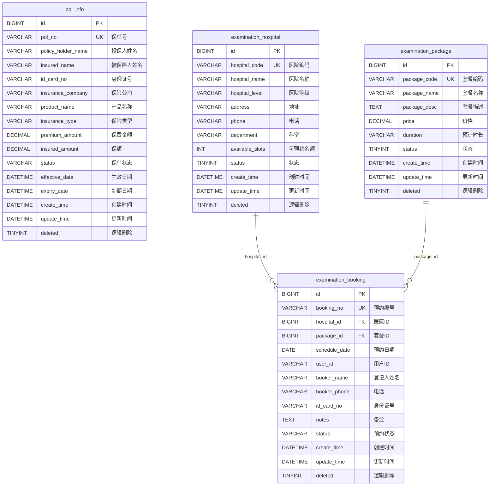
```mermaid
erDiagram
    pol_info {
        BIGINT id PK
        VARCHAR pol_no UK "保单号"
        VARCHAR policy_holder_name "投保人姓名"
        VARCHAR insured_name "被保险人姓名"
        VARCHAR id_card_no "身份证号"
        VARCHAR insurance_company "保险公司"
        VARCHAR product_name "产品名称"
        VARCHAR insurance_type "保险类型"
        DECIMAL premium_amount "保费金额"
        DECIMAL insured_amount "保额"
        VARCHAR status "保单状态"
        DATETIME effective_date "生效日期"
        DATETIME expiry_date "到期日期"
        DATETIME create_time "创建时间"
        DATETIME update_time "更新时间"
        TINYINT deleted "逻辑删除"
    }

    examination_hospital {
        BIGINT id PK
        VARCHAR hospital_code UK "医院编码"
        VARCHAR hospital_name "医院名称"
        VARCHAR hospital_level "医院等级"
        VARCHAR address "地址"
        VARCHAR phone "电话"
        VARCHAR department "科室"
        INT available_slots "可预约名额"
        TINYINT status "状态"
        DATETIME create_time "创建时间"
        DATETIME update_time "更新时间"
        TINYINT deleted "逻辑删除"
    }

    examination_package {
        BIGINT id PK
        VARCHAR package_code UK "套餐编码"
        VARCHAR package_name "套餐名称"
        TEXT package_desc "套餐描述"
        DECIMAL price "价格"
        VARCHAR duration "预计时长"
        TINYINT status "状态"
        DATETIME create_time "创建时间"
        DATETIME update_time "更新时间"
        TINYINT deleted "逻辑删除"
    }

    examination_booking {
        BIGINT id PK
        VARCHAR booking_no UK "预约编号"
        BIGINT hospital_id FK "医院ID"
        BIGINT package_id FK "套餐ID"
        DATE schedule_date "预约日期"
        VARCHAR user_id "用户ID"
        VARCHAR booker_name "登记人姓名"
        VARCHAR booker_phone "电话"
        VARCHAR id_card_no "身份证号"
        TEXT notes "备注"
        VARCHAR status "预约状态"
        DATETIME create_time "创建时间"
        DATETIME update_time "更新时间"
        TINYINT deleted "逻辑删除"
    }

    examination_hospital ||--o{ examination_booking : "hospital_id"
    examination_package ||--o{ examination_booking : "package_id"
```

### 4.2 表结构详情

#### 4.2.1 pol\_info（保单信息表）

| 字段                   | 类型            | 约束                           | 说明                           |
| -------------------- | ------------- | ---------------------------- | ---------------------------- |
| id                   | BIGINT        | PK, AUTO\_INCREMENT          | 主键                           |
| pol\_no              | VARCHAR(64)   | UK, NOT NULL                 | 保单号                          |
| policy\_holder\_name | VARCHAR(128)  | NOT NULL, INDEX              | 投保人姓名                        |
| insured\_name        | VARCHAR(128)  | NOT NULL                     | 被保险人姓名                       |
| id\_card\_no         | VARCHAR(18)   | NOT NULL                     | 身份证号                         |
| insurance\_company   | VARCHAR(128)  | NOT NULL, INDEX              | 保险公司                         |
| product\_name        | VARCHAR(256)  | NOT NULL                     | 产品名称                         |
| insurance\_type      | VARCHAR(64)   | —                            | 保险类型（健康险/寿险/意外险/医疗险）         |
| premium\_amount      | DECIMAL(10,2) | —                            | 保费金额                         |
| insured\_amount      | DECIMAL(12,2) | —                            | 保额                           |
| status               | VARCHAR(32)   | INDEX                        | 状态（active/expired/cancelled） |
| effective\_date      | DATETIME      | —                            | 生效日期                         |
| expiry\_date         | DATETIME      | —                            | 到期日期（NULL = 终身）              |
| create\_time         | DATETIME      | DEFAULT CURRENT\_TIMESTAMP   | 创建时间                         |
| update\_time         | DATETIME      | ON UPDATE CURRENT\_TIMESTAMP | 更新时间                         |
| deleted              | TINYINT       | DEFAULT 0                    | 逻辑删除                         |

**初始数据**：15 条保单记录，涵盖 7 位投保人（张三/李四/王五/赵六/孙八/周九/吴十/郑十一），保险类型包括健康险、寿险、意外险、医疗险、财产险。

#### 4.2.2 examination\_hospital（医院信息表）

| 字段               | 类型           | 约束                  | 说明            |
| ---------------- | ------------ | ------------------- | ------------- |
| id               | BIGINT       | PK, AUTO\_INCREMENT | 主键            |
| hospital\_code   | VARCHAR(64)  | UK, NOT NULL        | 医院编码          |
| hospital\_name   | VARCHAR(128) | NOT NULL            | 医院名称          |
| hospital\_level  | VARCHAR(64)  | —                   | 医院等级          |
| address          | VARCHAR(256) | —                   | 地址            |
| phone            | VARCHAR(32)  | —                   | 联系电话          |
| department       | VARCHAR(128) | —                   | 体检科室          |
| available\_slots | INT          | DEFAULT 0           | 可预约名额         |
| status           | TINYINT      | DEFAULT 1           | 状态（0-停用 1-启用） |

**初始数据**：8 家三甲医院

| 编码                  | 名称            | 等级   | 可预约名额 |
| ------------------- | ------------- | ---- | ----- |
| PEKING\_UNION       | 北京协和医院        | 三级甲等 | 15    |
| PEKING\_301         | 301医院         | 三级甲等 | 20    |
| PEKING\_FIRST       | 北京大学第一医院      | 三级甲等 | 12    |
| SHANGHAI\_ZHONGSHAN | 复旦大学附属中山医院    | 三级甲等 | 18    |
| SHANGHAI\_RUIJIN    | 上海交大医学院附属瑞金医院 | 三级甲等 | 16    |
| GUANGDONG\_GENERAL  | 广东省人民医院       | 三级甲等 | 22    |
| WEST\_CHINA         | 四川大学华西医院      | 三级甲等 | 25    |
| WUHAN\_TONGJI       | 武汉同济医院        | 三级甲等 | 19    |

#### 4.2.3 examination\_package（体检套餐表）

| 字段            | 类型            | 约束                  | 说明       |
| ------------- | ------------- | ------------------- | -------- |
| id            | BIGINT        | PK, AUTO\_INCREMENT | 主键       |
| package\_code | VARCHAR(64)   | UK, NOT NULL        | 套餐编码     |
| package\_name | VARCHAR(128)  | NOT NULL            | 套餐名称     |
| package\_desc | TEXT          | —                   | 套餐描述     |
| price         | DECIMAL(10,2) | —                   | 价格       |
| duration      | VARCHAR(32)   | —                   | 预计时长（分钟） |
| status        | TINYINT       | DEFAULT 1           | 状态       |

**初始数据**：5 个体检套餐

| 编码              | 名称       | 价格     | 时长    |
| --------------- | -------- | ------ | ----- |
| PKG\_BASIC      | 基础体检套餐   | ¥299   | 60分钟  |
| PKG\_FULL       | 全身体检套餐   | ¥899   | 120分钟 |
| PKG\_EMPLOYMENT | 入职体检套餐   | ¥199   | 45分钟  |
| PKG\_SENIOR     | 老年体检套餐   | ¥1,299 | 150分钟 |
| PKG\_WOMAN      | 女性专项体检套餐 | ¥799   | 90分钟  |

#### 4.2.4 examination\_booking（体检预约表）

| 字段             | 类型           | 约束                  | 说明                                |
| -------------- | ------------ | ------------------- | --------------------------------- |
| id             | BIGINT       | PK, AUTO\_INCREMENT | 主键                                |
| booking\_no    | VARCHAR(64)  | UK, NOT NULL        | 预约编号                              |
| hospital\_id   | BIGINT       | FK, NOT NULL, INDEX | 医院ID                              |
| package\_id    | BIGINT       | FK, NOT NULL, INDEX | 套餐ID                              |
| schedule\_date | DATE         | NOT NULL, INDEX     | 预约日期                              |
| user\_id       | VARCHAR(64)  | NOT NULL, INDEX     | 用户ID                              |
| booker\_name   | VARCHAR(128) | NOT NULL            | 登记人姓名                             |
| booker\_phone  | VARCHAR(32)  | NOT NULL            | 电话                                |
| id\_card\_no   | VARCHAR(18)  | —                   | 身份证号                              |
| notes          | TEXT         | —                   | 备注                                |
| status         | VARCHAR(32)  | DEFAULT 'confirmed' | 状态（confirmed/cancelled/completed） |

***

## 5. 后端详细设计

### 5.1 包结构

```
com.healthagent/
├── HealthAgentApplication.java        # 启动类
├── common/
│   ├── IntentType.java                # 意图类型枚举
│   └── Result.java                    # 统一响应结果
├── config/
│   ├── WebConfig.java                 # CORS + 拦截器配置
│   ├── JwtSecretProvider.java         # JWT 密钥管理
│   ├── SkillConfigLoader.java         # 技能配置加载
│   ├── MyMetaObjectHandler.java       # MyBatis-Plus 自动填充
│   └── ConfigValidationRunner.java    # 配置校验
├── controller/
│   ├── SmartChatController.java       # 智能对话
│   ├── PolicyController.java          # 保单管理
│   ├── ExaminationController.java     # 体检预约
│   └── AuthController.java            # 认证
├── dto/
│   ├── SmartChatRequest.java          # 对话请求
│   ├── SmartChatResponse.java         # 对话响应
│   ├── ExaminationIntentData.java     # 体检意图数据
│   ├── ExaminationBookingDTO.java     # 预约 DTO
│   ├── ExaminationBookingRequestDTO.java
│   ├── ExaminationHospitalDTO.java
│   ├── ExaminationPackageDTO.java
│   ├── PolicyInfo.java                # 保单信息 DTO
│   ├── PolicyQueryRequest.java        # 保单查询请求
│   ├── LoginRequest.java
│   ├── LoginResponse.java
│   └── RefreshTokenRequest.java
├── entity/
│   ├── PolInfoEntity.java
│   ├── ExaminationHospitalEntity.java
│   ├── ExaminationPackageEntity.java
│   ├── ExaminationPlanEntity.java
│   └── ExaminationBookingEntity.java
├── interceptor/
│   └── AuthInterceptor.java           # JWT 认证拦截器
├── mapper/
│   ├── PolInfoMapper.java
│   ├── ExaminationHospitalMapper.java
│   ├── ExaminationPackageMapper.java
│   ├── ExaminationPlanMapper.java
│   └── ExaminationBookingMapper.java
└── service/
    ├── SmartChatService.java          # 核心编排服务
    ├── IntentRecognitionService.java  # 意图识别
    ├── ExaminationIntentService.java  # 体检意图提取
    ├── ExaminationService.java        # 体检预约业务
    ├── PolicyService.java             # 保单查询业务
    ├── AuthService.java               # 认证服务
    ├── SessionManager.java            # 会话管理
    ├── DataMaskingService.java        # 数据脱敏
    ├── SkillExecutionService.java     # 技能执行
    └── chat/
        ├── AbstractChatClient.java    # LLM 客户端抽象类
        ├── GlmChatClient.java         # GLM 实现
        ├── QwenChatClient.java        # 通义千问实现
        └── ChatClientFactory.java     # 客户端工厂
```

### 5.2 核心服务详解

#### 5.2.1 SmartChatService（核心编排）

**职责**：接收用户消息，通过 SessionManager 获取/识别意图，按意图类型分发至对应处理器。

**核心方法**：

```java
public SmartChatResponse chat(SmartChatRequest request)
```

**处理流程**：

1. 从 SessionManager 获取缓存意图，若未命中则调用 IntentRecognitionService
2. 根据 IntentType 分发：
   - `QUERY_POLICY` → `handleInsuranceQuery()`
   - `BOOK_EXAMINATION` → `handleExaminationBooking()`
   - `HEALTH_CONSULTATION` / `GENERAL_CONVERSATION` → `handleGeneralConversation()`

**设计特点**：

- 意图缓存机制避免重复识别，同一用户同一会话内意图不变
- 保单查询后调用 LLM 做友好化处理（`generatePolicyResponse()`）
- 体检预约使用多轮对话模式，通过 SessionManager 合并信息

#### 5.2.2 IntentRecognitionService（意图识别）

**职责**：将用户自然语言消息分类为四种意图之一。

**识别 Prompt 结构**：

- System: "你是一个意图识别助手，请只返回意图代码"
- User: 包含用户消息 + 四种意图说明 + 关键词提示

**意图映射**：

| IntentType            | Code                  | 触发关键词    |
| --------------------- | --------------------- | -------- |
| QUERY\_POLICY         | query\_policy         | 保单、保险、理赔 |
| BOOK\_EXAMINATION     | book\_examination     | 体检、预约、检查 |
| HEALTH\_CONSULTATION  | health\_consultation  | 健康、症状、疾病 |
| GENERAL\_CONVERSATION | general\_conversation | 闲聊、问候    |

**容错**：LLM 返回无效意图时，`IntentType.fromCode()` 支持模糊匹配（`code.contains(type.code)`），兜底返回 `GENERAL_CONVERSATION`。

#### 5.2.3 ExaminationIntentService（体检意图提取）

**职责**：从用户消息中提取体检预约所需的结构化参数。

**提取参数**：

```json
{
    "hospitalName": "医院名称",
    "hospitalCode": "医院代码",
    "examinationDate": "YYYY-MM-DD",
    "examinationTime": "上午9点",
    "packageType": "全身体检",
    "notes": "备注",
    "confidence": 0.8
}
```

**双重策略**：

1. **LLM 优先**：调用 GLM API 提取 JSON 格式参数
2. **规则兜底**：LLM 失败时使用正则匹配 + 关键词匹配
   - 医院名：遍历 8 家医院关键词 + 正则 `(.+?医院)`
   - 日期：匹配 `YYYY-MM-DD` 格式 + "明天/后天/下周"
   - 时间：匹配 `\d{1,2}[点时]` + "上午/下午"

**JSON 清理**：自动去除 LLM 返回的 markdown 代码块标记（`json ... ` ）。

#### 5.2.4 SessionManager（会话管理）

**职责**：管理用户会话状态，维护三类 ConcurrentHashMap 缓存。

**缓存结构**：

| 缓存 Map                  | Key       | Value                 | 用途     |
| ----------------------- | --------- | --------------------- | ------ |
| sessionHistory          | sessionId | List\<ChatMessage>    | 对话历史   |
| userIntentCache         | userId    | IntentType            | 意图缓存   |
| examinationBookingCache | userId    | ExaminationIntentData | 体检预约信息 |

**关键方法**：

- `updateCachedExaminationIntent()`：合并新旧意图数据，非空字段覆盖
- `mergeExaminationIntentData()`：字段级别 merge，新值优先
- `isNotBlank()` 判空后设置 `bookingReady` 标志

#### 5.2.5 PolicyService（保单查询）

**双模式设计**：

1. **MyBatis-Plus DB 模式**：通过 PolInfoMapper 查询 examination\_hospital 数据库
   - `getByPolNo()` / `getByPolicyHolderName()` / `getByIdCardNo()`
   - `queryPolicies()` / `queryPoliciesPage()`
   - `createPolicy()` / `updatePolicy()` / `deleteByPolNo()`
2. **Mock 模式**（兼容旧接口）：静态 HashMap，按 userId 映射
   - `getUserPolicies()` — 仅返回 active 保单
   - `getAllUserPolicies()` — 返回全部含 expired
   - `formatPoliciesAsText()` — 格式化为文本

**注意**：SmartChatService 中对话走的是 Mock 模式，PolicyController 中走的是 DB 模式。

#### 5.2.6 ExaminationService（体检预约）

**核心方法**：

| 方法                                 | 说明                   |
| ---------------------------------- | -------------------- |
| `getAvailableHospitals()`          | 查询启用状态的医院列表          |
| `searchHospitals(keyword)`         | 按名称/编码/等级/科室模糊搜索     |
| `getAvailablePackages()`           | 查询启用状态的套餐列表          |
| `bookExamination(request)`         | 创建预约（生成预约号 + 插入 DB）  |
| `getUserBookings(userId)`          | 查询用户预约列表             |
| `getBookingByNo(bookingNo)`        | 按预约号查详情              |
| `cancelBooking(bookingNo, userId)` | 取消预约（改状态为 cancelled） |

**预约号生成规则**：`EXM` + `yyyyMMddHHmmss` + 4位随机数

#### 5.2.7 AuthService（认证服务）

**JWT 双 Token 机制**：

| Token 类型      | 生成方式             | 有效期        | 存储    |
| ------------- | ---------------- | ---------- | ----- |
| Access Token  | JJWT HMAC-SHA 签名 | 120 分钟     | 客户端内存 |
| Refresh Token | UUID 去横线         | 168 小时（7天） | Redis |

**认证流程**：

1. 用户提交用户名密码 → `login()` 验证（目前仅支持默认账户 admin/admin123）
2. 签发 Access Token + Refresh Token
3. Refresh Token 存入 Redis（key: `auth:refresh:{token}`）
4. Access Token 过期后用 Refresh Token 换取新 Token 对
5. 登出时删除 Redis 中的 Refresh Token

**密钥管理**：JwtSecretProvider 动态提供签名密钥，未配置 JWT\_SECRET 时自动生成临时强密钥。

#### 5.2.8 DataMaskingService（数据脱敏）

**脱敏规则**：

| 数据类型 | 规则       | 示例                    |
| ---- | -------- | --------------------- |
| 保单号  | 保留前2后2   | POL2024\*\*\*\*01     |
| 身份证  | 保留前6后4   | 110101\*\*\*\*1234    |
| 手机号  | 保留前3后4   | 138\*\*\*\*8000       |
| 银行卡  | 保留前4后4   | 6222\*\*\*\*1234      |
| 邮箱   | 保留首字符+@后 | z\*\*\*\*@example.com |
| 姓名   | 保留首字     | 张\* / 张\*\*           |

### 5.3 LLM 客户端设计

#### 5.3.1 模板方法模式

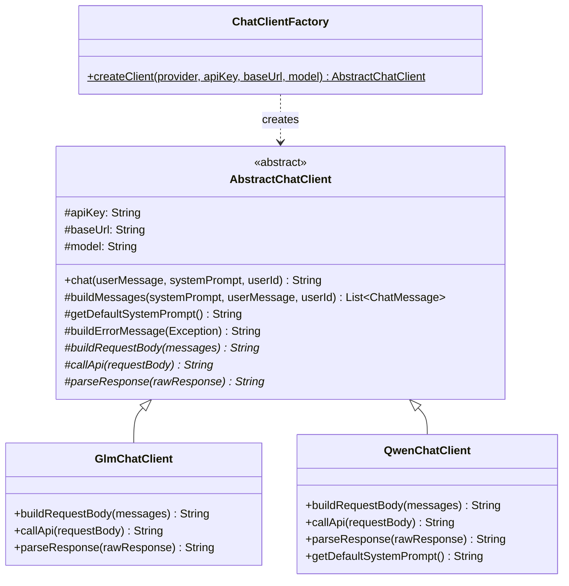
```mermaid
classDiagram
    class AbstractChatClient {
        <<abstract>>
        #apiKey: String
        #baseUrl: String
        #model: String
        +chat(userMessage, systemPrompt, userId) String
        #buildMessages(systemPrompt, userMessage, userId) List~ChatMessage~
        #getDefaultSystemPrompt() String
        #buildErrorMessage(Exception) String
        #buildRequestBody(messages)* String
        #callApi(requestBody)* String
        #parseResponse(rawResponse)* String
    }

    class GlmChatClient {
        +buildRequestBody(messages) String
        +callApi(requestBody) String
        +parseResponse(rawResponse) String
    }

    class QwenChatClient {
        +buildRequestBody(messages) String
        +callApi(requestBody) String
        +parseResponse(rawResponse) String
        +getDefaultSystemPrompt() String
    }

    class ChatClientFactory {
        +createClient(provider, apiKey, baseUrl, model)$ AbstractChatClient
    }

    AbstractChatClient <|-- GlmChatClient
    AbstractChatClient <|-- QwenChatClient
    ChatClientFactory ..> AbstractChatClient : creates
```

**模板方法** **`chat()`**：

1. `buildMessages()` — 构建 \[system, user] 消息列表
2. `buildRequestBody()` — 子类实现，构建 JSON 请求体
3. `callApi()` — 子类实现，发送 HTTP 请求
4. `parseResponse()` — 子类实现，解析响应 JSON

**GLM 与 Qwen 差异**：

| 项目     | GLM                           | Qwen                                                   |
| ------ | ----------------------------- | ------------------------------------------------------ |
| API 路径 | /api/paas/v4/chat/completions | /api/v1/services/aigc/text-generation/generation       |
| 请求格式   | messages 直接在根级                | messages 嵌套在 input 对象中                                 |
| 认证头    | Authorization: Bearer {key}   | Authorization: Bearer {key} + X-DashScope-SSE: disable |
| 响应路径   | choices\[0].message.content   | output.choices\[0].message.content                     |

***

## 6. 前端详细设计

### 6.1 页面路由

| 路由                    | 组件                      | 需认证 | 说明          |
| --------------------- | ----------------------- | --- | ----------- |
| /login                | LoginPage               | 否   | 登录页         |
| /dashboard            | DashboardPage           | 是   | 仪表盘首页       |
| /chat                 | ChatPage                | 是   | AI 对话（默认首页） |
| /policy               | PolicyPage              | 是   | 保单查询        |
| /examination/packages | ExaminationPackagesPage | 是   | 体检套餐列表      |
| /examination/detail   | ExaminationDetailPage   | 是   | 体检详情/预约     |
| /examination/bookings | ExaminationBookingsPage | 是   | 预约记录        |

**路由守卫**：`router.beforeEach` 检查 `isAuthenticated`，未认证重定向至 /login。

### 6.2 核心页面设计

#### 6.2.1 ChatPage（AI 对话页面）

**布局结构**：

- **顶栏**：渐变蓝→青背景，健康助手标题 + HeartPulse 图标，首页/菜单按钮，用户头像
- **消息区**：滚动容器，日期标签 + 欢迎消息 + 对话气泡
  - 用户消息：蓝→青渐变气泡，右对齐
  - AI 回复：白色气泡，左对齐
  - 加载状态：三点弹跳动画
- **输入区**：
  - 快捷按钮：保单查询 / 体检预约
  - 语音输入按钮（Mic 图标，录音时红色脉冲动画）
  - 文本输入框 + 发送按钮

**语音输入**：

- 使用 Web Speech API（`SpeechRecognition` / `webkitSpeechRecognition`）
- 语言：zh-CN
- 支持中间结果（interimResults = true）
- 错误处理：浏览器不支持提示 / 麦克风权限拒绝提示

**API 调用**：

```
POST /api/smart-chat/send
Body: { message, userId }
Response: { code: 200, data: { message, intent, action, ... } }
```

#### 6.2.2 DashboardPage（仪表盘）

**布局**：

- 顶栏：健康助手 Logo + 用户信息 + 退出按钮
- 功能卡片（3列网格）：
  - 保单查询（蓝色，Shield 图标）→ /policy
  - 体检预约（青色，Stethoscope 图标）→ /examination/packages
  - AI助手（紫色，Bot 图标）→ /chat
- 今日健康提示：渐变背景卡片

#### 6.2.3 PolicyPage（保单查询页面）

**功能**：展示用户保单列表，支持按保单号/投保人/身份证号查询。

#### 6.2.4 Examination 相关页面

- **ExaminationPackagesPage**：体检套餐列表
- **ExaminationDetailPage**：套餐详情 + 预约表单
- **ExaminationBookingsPage**：预约记录查看/取消

### 6.3 认证流程

**useAuth 组合式函数**：

- `isAuthenticated` — 认证状态响应式变量
- `user` — 当前用户信息
- `login(username, password)` — 登录
- `logout()` — 登出
- `checkAuth()` — 检查认证状态

**Token 存储**：localStorage 存储 Access Token 和 Refresh Token。

***

## 7. AI 对话引擎设计

### 7.1 对话引擎架构

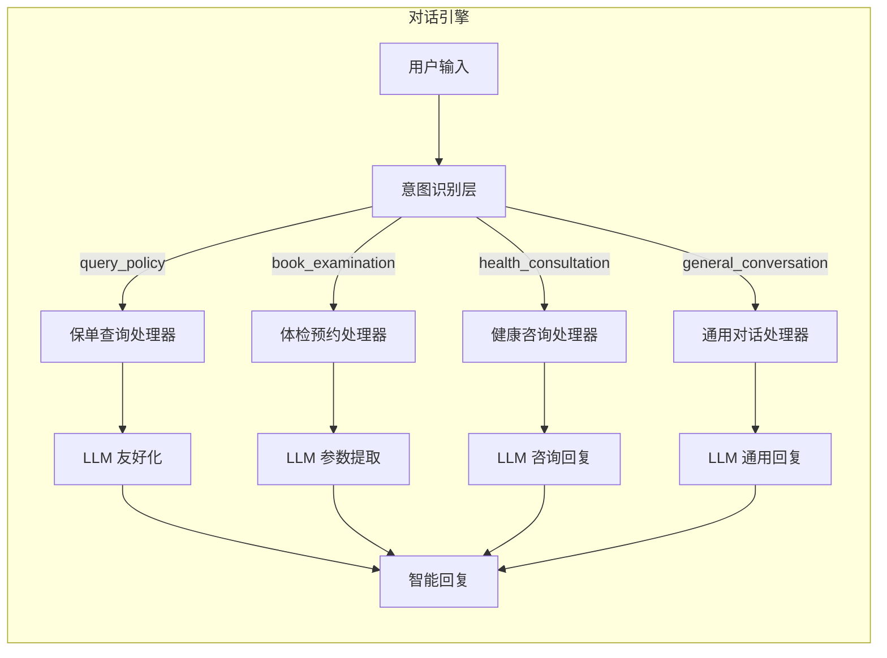
```mermaid
graph LR
    subgraph "对话引擎"
        Input[用户输入] --> IR[意图识别层]
        IR --> |query_policy| PQ[保单查询处理器]
        IR --> |book_examination| EB[体检预约处理器]
        IR --> |health_consultation| HC[健康咨询处理器]
        IR --> |general_conversation| GC[通用对话处理器]
        
        PQ --> LLM1[LLM 友好化]
        EB --> LLM2[LLM 参数提取]
        HC --> LLM3[LLM 咨询回复]
        GC --> LLM4[LLM 通用回复]
        
        LLM1 --> Output[智能回复]
        LLM2 --> Output
        LLM3 --> Output
        LLM4 --> Output
    end
```

### 7.2 Prompt 设计

#### 7.2.1 意图识别 Prompt

```
请分析以下用户消息，判断用户的意图。

用户消息: {userMessage}

可选意图类型:
- query_policy: 用户想查询保单信息（包含"保单"、"保险"、"理赔"等关键词）
- book_examination: 用户想预约体检（包含"体检"、"预约"、"检查"等关键词）
- health_consultation: 用户想进行健康咨询（包含"健康"、"症状"、"疾病"、"怎么办"等关键词）
- general_conversation: 一般对话、闲聊、问候等

请只返回一个意图代码，不需要其他解释。
```

**System Prompt**: "你是一个意图识别助手，请只返回意图代码，不需要其他解释。"

#### 7.2.2 体检参数提取 Prompt

```
请分析用户消息，提取体检预约相关信息。

用户消息: {userMessage}

请以JSON格式返回以下信息：
{
    "hospitalName": "医院名称（如果没有明确提到，请填null）",
    "hospitalCode": "医院代码（如果没有明确提到，请填null）",
    "examinationDate": "体检日期，格式YYYY-MM-DD（如果没有明确提到，请填null）",
    "examinationTime": "体检时间，如'上午9点'（如果没有明确提到，请填null）",
    "packageType": "套餐类型（如果没有明确提到，请填null）",
    "notes": "其他备注信息（如果没有，请填null）",
    "confidence": 0.0到1.0之间的置信度
}

只返回JSON，不要有其他内容。
```

#### 7.2.3 保单友好化回复 Prompt

```
用户询问保单相关问题，以下是查询到的保单信息：

{policyInfo}

请根据以上信息，用友好的方式回复用户，可以：
1. 总结保单的主要特点
2. 提醒用户关注的事项
3. 询问是否需要了解更多信息

用户原问题：{userMessage}

回复要简洁，自然，像一个专业的保险顾问。
```

### 7.3 对话状态管理

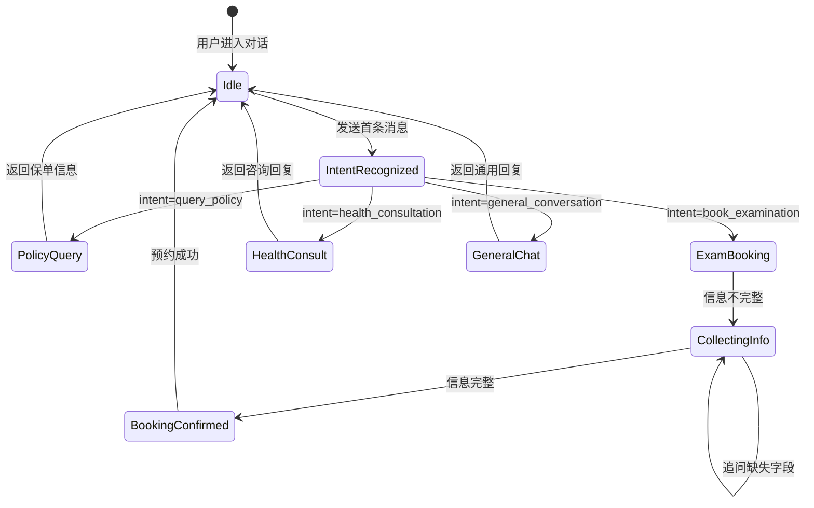
```mermaid
stateDiagram-v2
    [*] --> Idle: 用户进入对话
    Idle --> IntentRecognized: 发送首条消息
    IntentRecognized --> PolicyQuery: intent=query_policy
    IntentRecognized --> ExamBooking: intent=book_examination
    IntentRecognized --> HealthConsult: intent=health_consultation
    IntentRecognized --> GeneralChat: intent=general_conversation
    
    PolicyQuery --> Idle: 返回保单信息
    ExamBooking --> CollectingInfo: 信息不完整
    CollectingInfo --> CollectingInfo: 追问缺失字段
    CollectingInfo --> BookingConfirmed: 信息完整
    BookingConfirmed --> Idle: 预约成功
    HealthConsult --> Idle: 返回咨询回复
    GeneralChat --> Idle: 返回通用回复
```

***

## 8. 认证与安全

### 8.1 JWT 认证流程

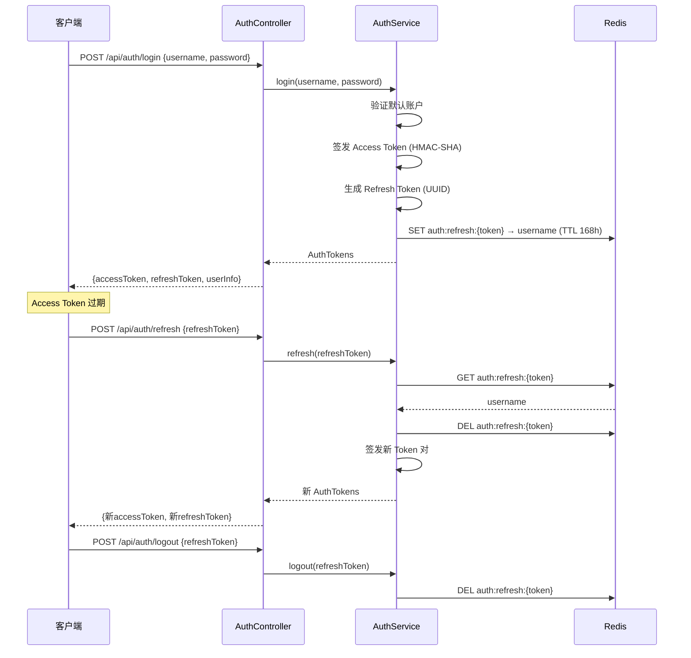
```mermaid
sequenceDiagram
    participant C as 客户端
    participant S as AuthController
    participant A as AuthService
    participant R as Redis

    C->>S: POST /api/auth/login {username, password}
    S->>A: login(username, password)
    A->>A: 验证默认账户
    A->>A: 签发 Access Token (HMAC-SHA)
    A->>A: 生成 Refresh Token (UUID)
    A->>R: SET auth:refresh:{token} → username (TTL 168h)
    A-->>S: AuthTokens
    S-->>C: {accessToken, refreshToken, userInfo}

    Note over C: Access Token 过期

    C->>S: POST /api/auth/refresh {refreshToken}
    S->>A: refresh(refreshToken)
    A->>R: GET auth:refresh:{token}
    R-->>A: username
    A->>R: DEL auth:refresh:{token}
    A->>A: 签发新 Token 对
    A-->>S: 新 AuthTokens
    S-->>C: {新accessToken, 新refreshToken}

    C->>S: POST /api/auth/logout {refreshToken}
    S->>A: logout(refreshToken)
    A->>R: DEL auth:refresh:{token}
```

### 8.2 AuthInterceptor

- 拦截路径：`/api/**`
- 排除路径：`/api/auth/login`, `/api/auth/refresh`, `/api/auth/current`, `/api/chat/**`, `/swagger-ui/**`, `/v3/api-docs/**`
- Token 提取：`Authorization: Bearer {token}` 或 `?token={token}`
- 开关：`healthagent.auth.interceptor-enabled`（默认 false，仅调试用）

### 8.3 CORS 配置

- 允许来源：`http://localhost:5173`, `http://127.0.0.1:5173`, `http://localhost:5174`, `http://127.0.0.1:5174`
- 允许方法：GET, POST, PUT, DELETE, OPTIONS
- 允许凭证：true
- 预检缓存：3600s

### 8.4 数据脱敏

SkillExecutionService 在格式化保单信息时，自动对以下字段进行脱敏：

- 保单号：`maskPolicyId()` → 保留前2后2
- 身份证号：`maskIdCard()` → 保留前6后4
- 姓名脱敏：`maskName()` → 保留首字

***

## 9. API 接口文档

### 9.1 认证接口

| 方法   | 路径                | 说明     |
| ---- | ----------------- | ------ |
| POST | /api/auth/login   | 用户登录   |
| POST | /api/auth/logout  | 用户登出   |
| POST | /api/auth/refresh | 刷新令牌   |
| GET  | /api/auth/current | 获取当前用户 |

### 9.2 智能对话接口

| 方法   | 路径                   | 说明     |
| ---- | -------------------- | ------ |
| POST | /api/smart-chat/send | 发送对话消息 |

**请求体**：

```json
{
    "message": "我想查询保单",
    "userId": "admin"
}
```

**响应体**：

```json
{
    "code": 200,
    "message": "操作成功",
    "data": {
        "intent": "query_policy",
        "message": "您共有2份有效保单...",
        "action": "query_policy_success",
        "messageType": "policy_info",
        "needsMoreInfo": false,
        "data": [...]
    }
}
```

### 9.3 保单查询接口

| 方法     | 路径                                      | 说明       |
| ------ | --------------------------------------- | -------- |
| POST   | /api/policy/query                       | 条件查询保单   |
| POST   | /api/policy/page?pageNum=1\&pageSize=10 | 分页查询     |
| GET    | /api/policy/{polNo}                     | 按保单号查询   |
| GET    | /api/policy/holder/{name}               | 按投保人姓名查询 |
| GET    | /api/policy/idcard/{idCardNo}           | 按身份证号查询  |
| GET    | /api/policy/all                         | 查询所有保单   |
| POST   | /api/policy                             | 新增保单     |
| PUT    | /api/policy                             | 更新保单     |
| DELETE | /api/policy/{polNo}                     | 删除保单     |

### 9.4 体检预约接口

| 方法     | 路径                                                | 说明     |
| ------ | ------------------------------------------------- | ------ |
| GET    | /api/examinations/hospitals                       | 获取医院列表 |
| GET    | /api/examinations/hospitals?keyword=协和            | 搜索医院   |
| GET    | /api/examinations/hospitals/{code}                | 医院详情   |
| GET    | /api/examinations/packages                        | 套餐列表   |
| POST   | /api/examinations/book                            | 创建预约   |
| GET    | /api/examinations/bookings/{bookingNo}            | 预约详情   |
| GET    | /api/examinations/users/{userId}/bookings         | 用户预约列表 |
| DELETE | /api/examinations/bookings/{bookingNo}?userId=xxx | 取消预约   |
| GET    | /api/examinations/requirements                    | 预约须知   |

***

## 10. 界面展示

> 以下截图来自系统实际运行效果

### 10.1 登录与仪表盘

**登录页面**：简洁的用户名/密码登录表单，支持记住登录状态。
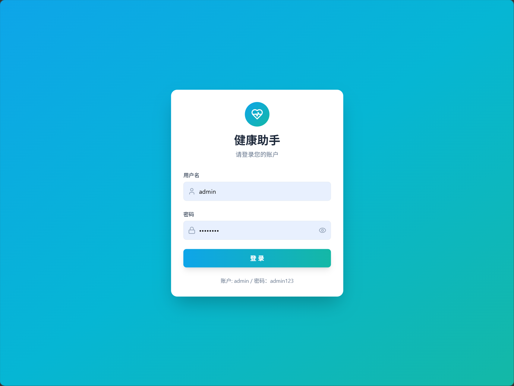

**Dashboard 仪表盘**：
展示三大核心功能入口卡片：保单查询、体检预约、AI助手，以及每日健康提示。
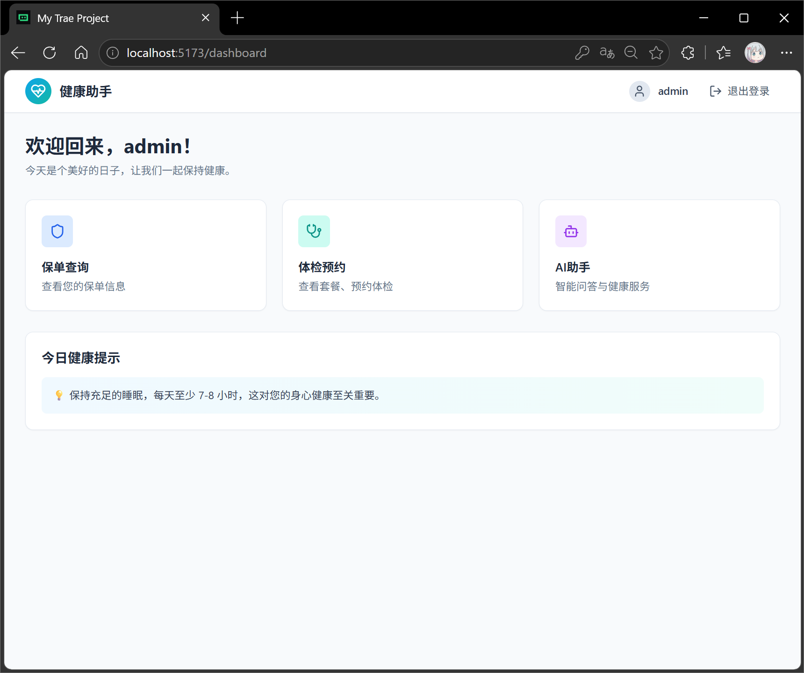

### 10.2 AI 对话界面

**主对话界面**：
- 顶部渐变蓝青色导航栏，显示"健康助手"标题
- 对话区域：用户消息右对齐蓝渐变气泡，AI回复左对齐白色气泡
- 底部快捷按钮：保单查询 / 体检预约
- 文本输入框 + 语音输入 + 发送按钮
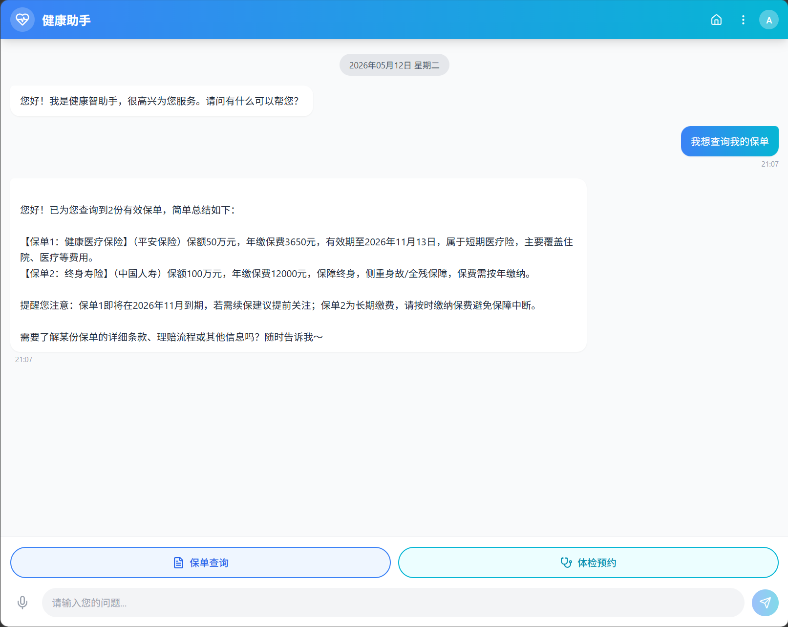

**语音输入**：

点击麦克风图标启动浏览器原生语音识别，录音时显示红色脉冲动画，识别结果自动填入输入框。
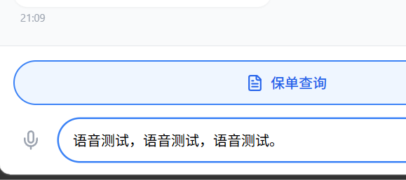

**上下文记忆**：
系统通过 SessionManager 维护对话上下文，已识别的意图在会话内持续有效，体检预约多轮对话自动合并历史信息。
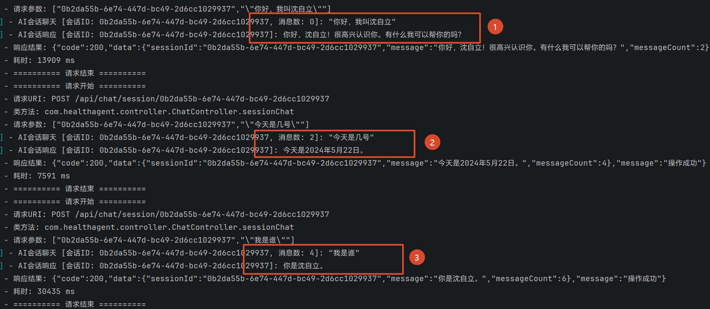

### 10.3 意图识别

系统自动将用户消息分类为四种意图之一，意图识别结果影响后续处理路径。
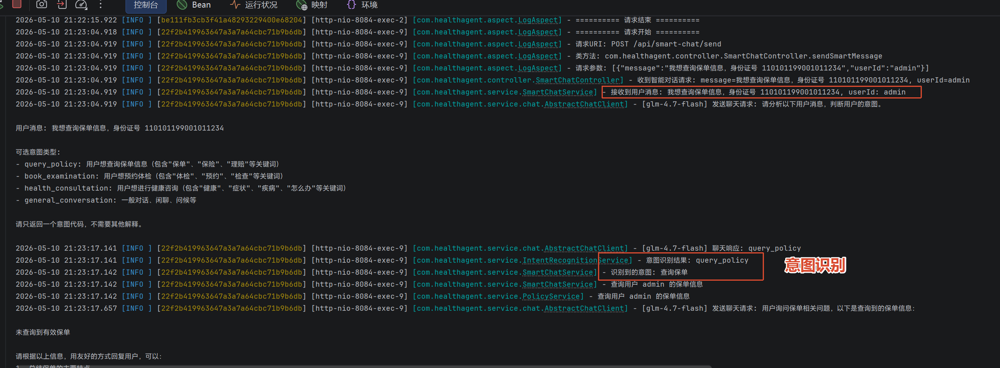

### 10.4 保单查询

**对话式查询**：

用户发送"我想查询我的保单"，系统识别为 query\_policy 意图，自动查询用户保单并以友好格式展示。


**页面式查询**：

PolicyPage 提供表单化查询界面，支持按保单号、投保人、身份证号等条件精确查询。
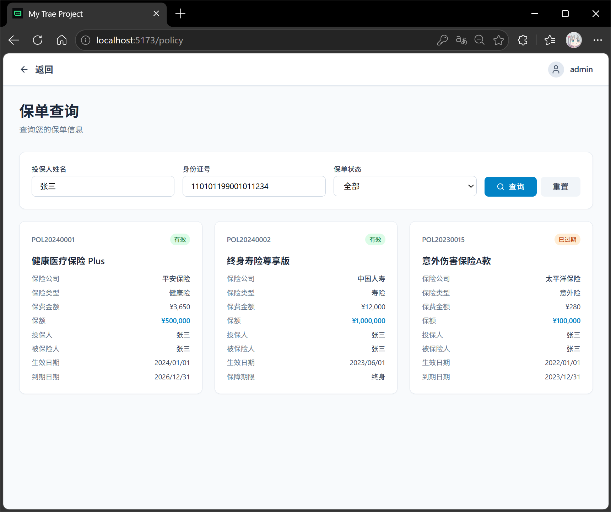

### 10.5 体检预约

**预约入口**：通过快捷按钮或自然语言触发

**预约对话**：多轮对话收集医院和日期信息
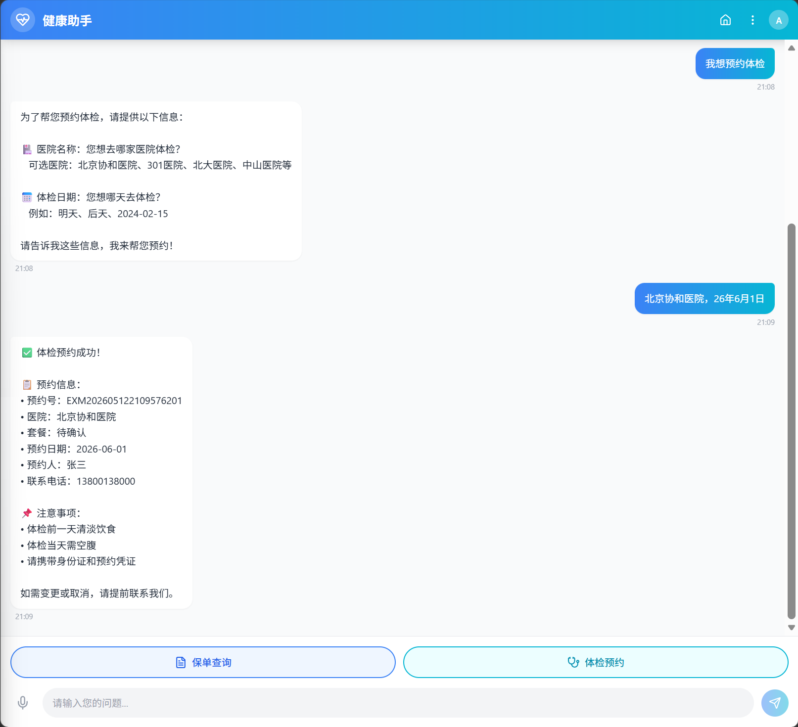

**预约成功**：显示预约号、医院、套餐、日期、注意事项
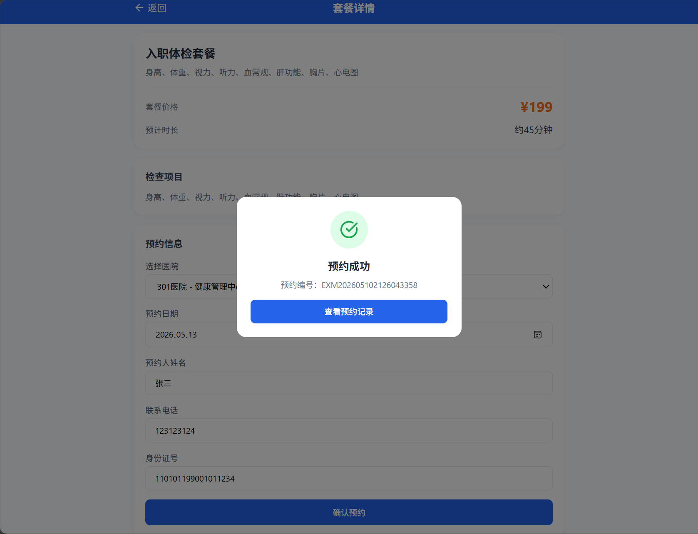

**预约记录**：查看历史预约列表
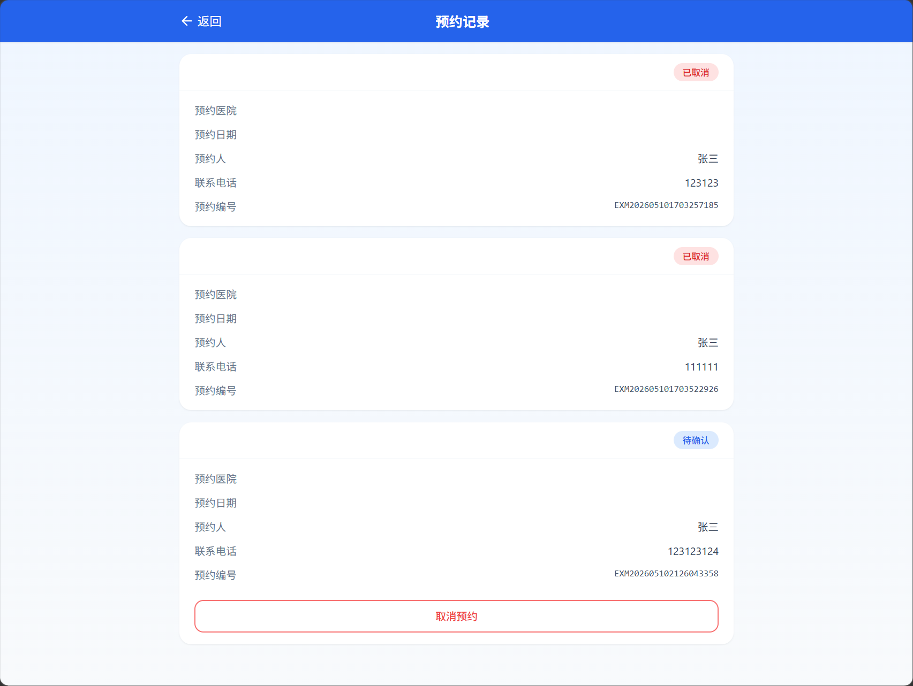

**体检套餐浏览**：查看5种体检套餐详情及价格
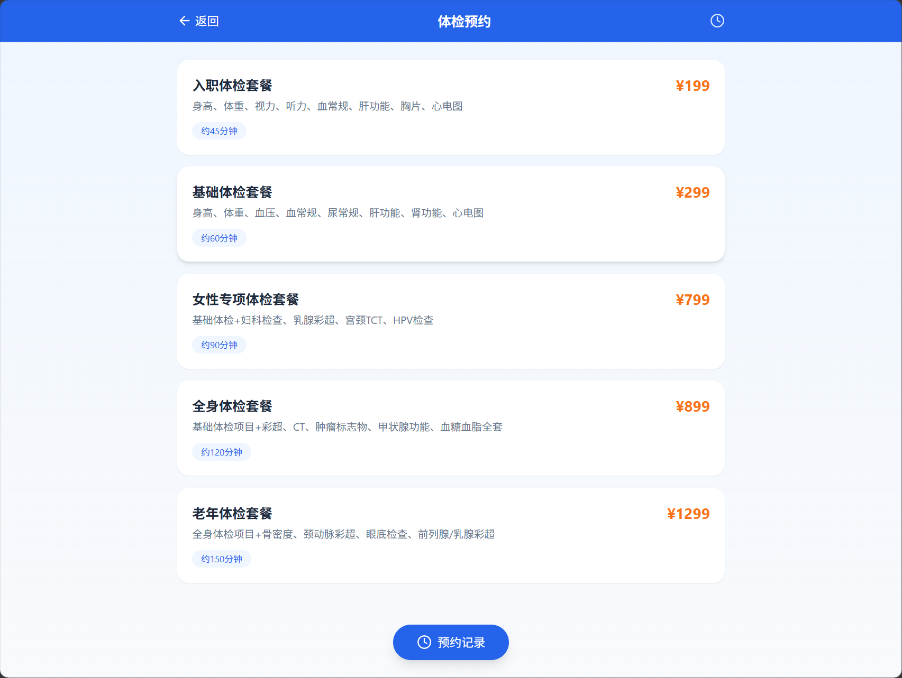

### 10.6 开发环境

项目使用 Trae IDE 进行开发，支持热重载和实时预览。
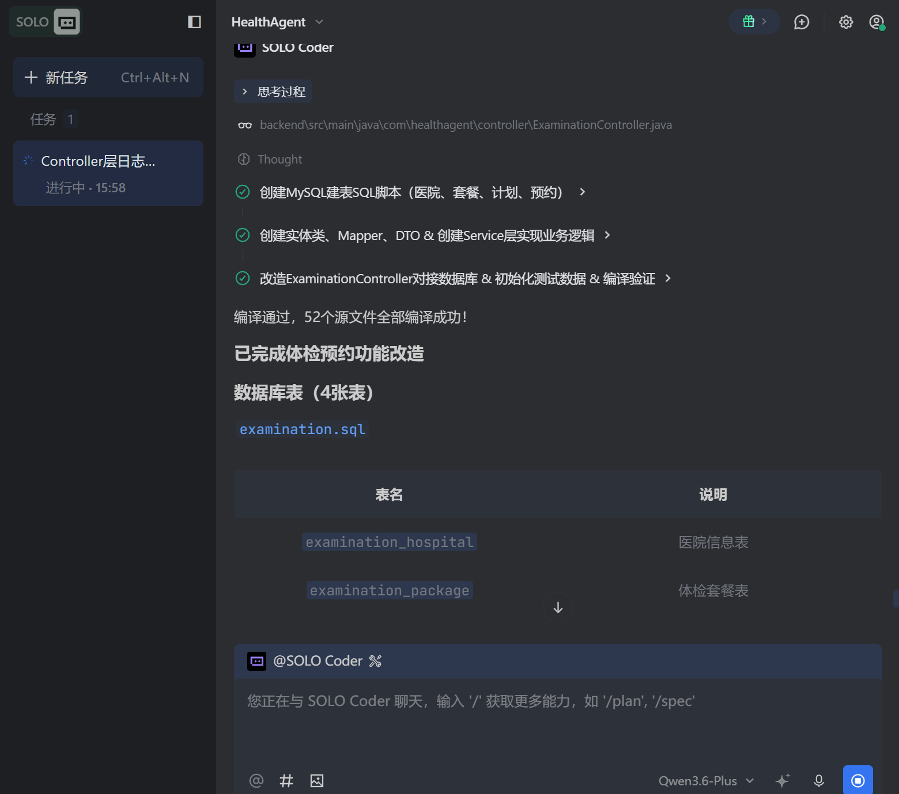

***

## 11. 部署与运维

### 11.1 环境要求

| 组件      | 最低版本 | 说明       |
| ------- | ---- | -------- |
| JDK     | 21+  | 后端运行时    |
| Node.js | 18+  | 前端构建     |
| MySQL   | 8.0+ | 数据库      |
| Redis   | 6.0+ | Token 存储 |

### 11.2 配置项

| 配置项                          | 默认值         | 说明         |
| ---------------------------- | ----------- | ---------- |
| server.port                  | 8084        | 后端端口       |
| MYSQL\_HOST                  | localhost   | MySQL 地址   |
| MYSQL\_PORT                  | 3306        | MySQL 端口   |
| MYSQL\_DATABASE              | healthagent | 数据库名       |
| MYSQL\_USERNAME              | root        | 数据库用户名     |
| MYSQL\_PASSWORD              | 123456      | 数据库密码      |
| REDIS\_HOST                  | localhost   | Redis 地址   |
| REDIS\_PORT                  | 6379        | Redis 端口   |
| JWT\_SECRET                  | (自动生成)      | JWT 签名密钥   |
| APP\_AUTH\_DEFAULT\_USERNAME | admin       | 默认用户名      |
| APP\_AUTH\_DEFAULT\_PASSWORD | admin123    | 默认密码       |
| AUTH\_INTERCEPTOR\_ENABLED   | false       | 认证拦截器开关    |
| healthagent.chat.model       | glm-4.6v    | LLM 模型     |
| healthagent.chat.provider    | glm         | LLM 提供商    |
| healthagent.glm.api-key      | (需配置)       | GLM API 密钥 |

### 11.3 启动流程

1. **初始化数据库**：
   ```sql
   CREATE DATABASE healthagent CHARACTER SET utf8mb4 COLLATE utf8mb4_unicode_ci;
   SOURCE sql/pol_info.sql;
   SOURCE sql/examination.sql;
   ```
2. **启动后端**：
   ```bash
   cd backend
   mvn spring-boot:run
   # 或 java -jar target/HealthAgent.jar
   ```
   后端启动于 `http://localhost:8084`
3. **启动前端**：
   ```bash
   cd frontend
   npm install
   npm run dev
   ```
   前端开发服务器启动于 `http://localhost:5173`，自动代理 `/api` 到后端
4. **访问**：打开 `http://localhost:5173`，使用 admin/admin123 登录

### 11.4 API 文档

启动后访问 Swagger UI：`http://localhost:8084/swagger-ui.html`

### 11.5 已知限制与改进方向

| 项目                | 当前状态                 | 改进方向          |
| ----------------- | -------------------- | ------------- |
| 用户注册              | 仅默认账户                | 增加注册功能 + 用户表  |
| 保单对话              | 使用 Mock 数据           | 统一走 DB 查询     |
| 意图缓存              | 全会话不变                | 支持意图切换/超时重识别  |
| 体检预约              | 部分信息硬编码              | 对话中动态获取姓名/手机号 |
| Token 存储          | 内存 ConcurrentHashMap | 迁移到 Redis 持久化 |
| examination\_plan | Mapper 存在但未使用        | 实现排期管理功能      |
| 前端状态              | 无 Pinia/Vuex         | 引入状态管理        |
| 文件上传              | 不支持                  | 支持图片/文档上传     |

***

> **文档结束** | HealthAgent v2.0 | 2026-05-12

